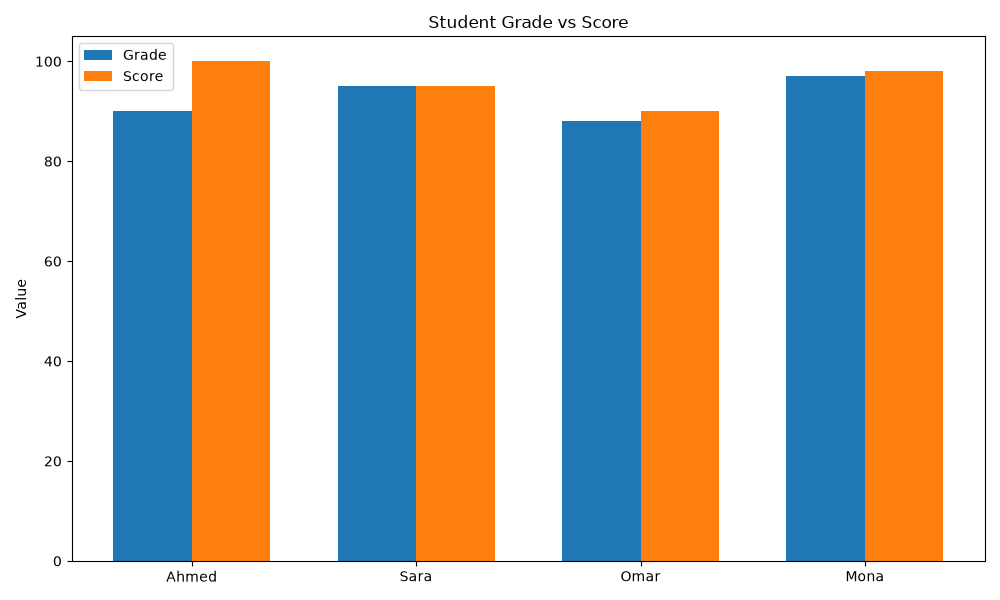

# 📊 Excel AI Analyst

Chat with your Excel files in plain English. Ask for calculations, edits, insights, and charts, and an AI agent does the work for you.

Built with **MCP (Model Context Protocol)**, **Groq**, **LangGraph**, and **Streamlit**.




## Features

- 💬 **Natural-language interface**: no formulas, no code
- 📖 **Read and inspect** any sheet in your workbook
- ✏️ **Edit Excel files**: create sheets, add columns, save results
- 🧠 **Insights**: real numbers (averages, rankings, correlations) explained in plain language
- 📈 **Visualizations**: bar charts, scatter plots, and more, shown right in the chat
- 🔁 **Self-correcting agent**: if its code fails, it reads the error and retries
- 📤 **Upload and download** your workbook from the sidebar

## How it works

```
Streamlit UI (app.py)
      │
      ▼
LangGraph ReAct agent (agent.py)  ◄──►  Groq LLM
      │
      ▼  MCP (stdio)
MCP server (task_server.py)
      │
      ▼
Runs Python (pandas, openpyxl, matplotlib) on students.xlsx
```

1. You type a request in the chat.
2. The agent decides what to do and calls the `run_excel_code` tool exposed by the MCP server.
3. The server runs the Python code, and the result (or error) goes back to the agent.
4. The agent loops until done, then answers. Any charts saved in `charts/` appear in the UI.

## Project structure

```
├── app.py            # Streamlit UI
├── agent.py          # LangGraph agent + MCP client + Groq
├── task_server.py    # MCP server with the code-execution tool
├── requirements.txt
├── .env              # your GROQ/OPENROUTER/.._API_KEY (not committed)
├── students.xlsx     # default workbook
└── charts/           # generated charts (created automatically)
```

## Getting started

### 1. Clone the repo

```bash
git clone https://github.com/<your-username>/<your-repo>.git
cd <your-repo>
```

### 2. Create a virtual environment and install dependencies

```bash
python -m venv .venv
.venv\Scripts\activate        # Windows
# source .venv/bin/activate   # macOS / Linux

pip install -r requirements.txt
```

### 3. Add your Groq API key

Get a free key at [console.groq.com](https://console.groq.com), then create a `.env` file in the project root:

```
GROQ_API_KEY=your_key_here
```

### 4. Run the app

```bash
streamlit run app.py
```

Open `http://localhost:8501` in your browser.

## Example prompts

- `Show me all students.`
- `Make a new sheet called Average that contains the average of scores.`
- `Who is the top student, and how far are they above the average?`
- `Plot a bar chart of scores by student and highlight the top scorer.`
- `Give me 3 insights about the relationship between grade and score, with a scatter plot.`
- `Create a Summary sheet with average, highest, and lowest score, add a rank column to the Students sheet, then chart grade vs. score.`

## ⚙️ Configuration

| Setting | Where | Notes |
|---|---|---|
| Model | `agent.py` (`ChatGroq(model=...)`) | Default `openai/gpt-oss-120b`. `llama-3.3-70b-versatile` also works. |
| Workbook | `students.xlsx` | Upload a different file from the sidebar; it is saved as `students.xlsx`. |
| Output limit | `task_server.py` (`MAX_OUTPUT`) | Keeps tool output short to save tokens. |

## 🛠️ Troubleshooting

- **Rate limit (429) errors**: Groq's free tier has token limits. Wait a minute or switch models.
- **`tool_use_failed` / "python tool not enabled"**: some models try to call a built-in `python` tool. The tool here is named `run_excel_code` and the prompt tells the model to use only that.
- **Permission error when saving**: close `students.xlsx` in Excel first.

## ⚠️ Security note

The MCP server executes model-generated Python code on your machine. Run it locally with files you trust, and do not expose it publicly without sandboxing (for example, Docker with no network access).

## 🗺️ Roadmap

- [ ] Multiple workbooks
- [ ] Interactive charts (Plotly)
- [ ] Sandboxed code execution
- [ ] Export chat reports to PDF

## 🤝 Contributing

Issues and pull requests are welcome.

## 📄 License

MIT
